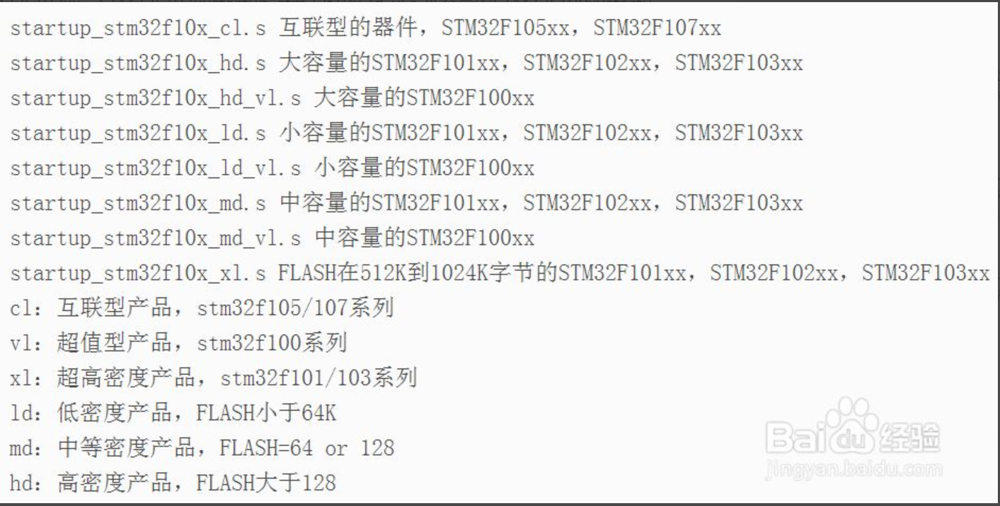
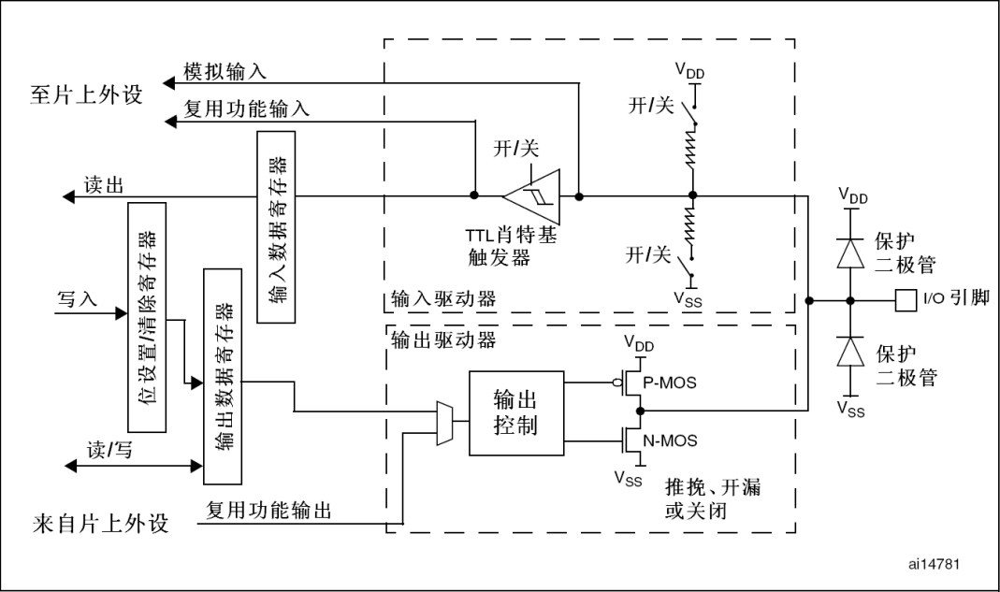
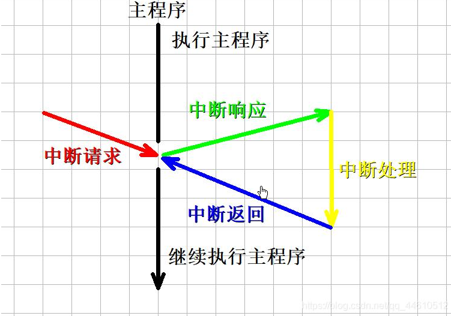

# STM32F103ZE学习笔记

# 新建模板

- 启动文件的选择

    

# GPIO

GPIO是单片机连接外部的接口。




## GPIO输出

### 示例操作

1. 使能GPIO口

   - ​	使能端口函数原型

   - ```c
     void RCC_APB2PeriphClockCmd(u32 RCC_APB2Periph, FunctionalState NewState)
     ```

   - 使能端口函数示例

   - ```c
     RCC_APB2PeriphClockCmd(LED_RCC_APB2Periph_GPIO, ENABLE);
     ```

2. 配置GPIO口

   - 配置GPIO口结构体原型

   - ```c
     typedef struct
     {
       uint16_t GPIO_Pin;             //端口
       GPIOSpeed_TypeDef GPIO_Speed;  //端口速度
       GPIOMode_TypeDef GPIO_Mode;    //端口模式
     }GPIO_InitTypeDef;
     ```

     

1. 将电平拉低或拉高

## GPIO输入


# 外部中断

### 中断定义

- 中断是指计算机运行过程中，出现某些意外情况需主机干预时，机器能自动停止正在运行的程序并转入处理新情况的程序，处理完毕后又返回原被暂停的程序继续运行。



### 示例操作

1. 端口初始化

    - 使能GPIO端口
    - 配置GPIO端口
    - 参照GPIO配置

2. 使能复用端口

    - 使能复用端口函数原型

    - ```C
        void RCC_APB2PeriphClockCmd(uint32_t RCC_APB2Periph, FunctionalState NewState)
        ```

    - 使能复用端口函数示例

    - ```C
        RCC_APB2PeriphClockCmd(RCC_APB2Periph_AFIO,ENABLE);
        ```

3. 绑定中断线

    - 绑定中断线函数原型

    - ```C
        void GPIO_EXTILineConfig(u8 GPIO_PortSource, u8 GPIO_PinSource)
        ```

    - 绑定中断线函数实例

    - ```c
        GPIO_EXTILineConfig(GPIO_PortSourceGPIOE,GPIO_PinSource4);
        ```

4. 配置外部中断

    - 配置外部中断结构体原型

    - ```C
        typedef struct
        {
          uint32_t EXTI_Line;                 //中断线
          EXTIMode_TypeDef EXTI_Mode;         //线路模式
          EXTITrigger_TypeDef EXTI_Trigger;   //触发方式                                
          FunctionalState EXTI_LineCmd;       //线路状态                     
        }EXTI_InitTypeDef;
        ```

    - **EXti_Line**  选择了待使能或者失能的外部线路 

    - | EXTI_Line   | 描述          |
        | ----------- | ------------- |
        | EXTI_Line0  | 外部中断线 0  |
        | EXTI_Line1  | 外部中断线 1  |
        | EXTI_Line2  | 外部中断线 2  |
        | EXTI_Line3  | 外部中断线 3  |
        | EXTI_Line4  | 外部中断线 4  |
        | EXTI_Line5  | 外部中断线 5  |
        | EXTI_Line6  | 外部中断线 6  |
        | EXTI_Line7  | 外部中断线 7  |
        | EXTI_Line8  | 外部中断线 8  |
        | EXTI_Line9  | 外部中断线 9  |
        | EXTI_Line10 | 外部中断线 10 |
        | EXTI_Line11 | 外部中断线 11 |
        | EXTI_Line12 | 外部中断线 12 |
        | EXTI_Line13 | 外部中断线 13 |
        | EXTI_Line14 | 外部中断线 14 |
        | EXTI_Line15 | 外部中断线 15 |
        | EXTI_Line16 | 外部中断线 16 |
        | EXTI_Line17 | 外部中断线 17 |

    - **EXTI_Mode**  线路的模式  

    - | EXTI_Mode           | 描述                     |
        | :------------------ | ------------------------ |
        | EXTI_Mode_Event     | 设置 EXTI 线路为事件请求 |
        | EXTI_Mode_Interrupt | 设置 EXTI 线路为中断请求 |

    - **EXTI_Trigger** 线路的触发边沿  

    - | EXTI_Trigger                | 描述                                 |
        | --------------------------- | ------------------------------------ |
        | EXTI_Trigger_Falling        | 设置输入线路下降沿为中断请求         |
        | EXTI_Trigger_Rising         | 设置输入线路上升沿为中断请求         |
        | EXTI_Trigger_Rising_Falling | 设置输入线路上升沿和下降沿为中断请求 |

    - **EXTI_LineCmd**  线路状态

    - | EXTI_LineCmd | 状态 |
        | :----------- | ---- |
        | ENABLE       | 使能 |
        | DISABLE      | 失能 |

    - 外部中断初始化函数原型

    - ```C
        void EXTI_Init(EXTI_InitTypeDef* EXTI_InitStruct)
        ```

    - 配置外部中断示例

    - ```C
        EXTI_InitTypeDef EXTI_InitStructure;
        EXTI_InitStructure.EXTI_Line = EXTI_Line4;               //中断线4
        EXTI_InitStructure.EXTI_Mode = EXTI_Mode_Interrupt;      //中断请求
        EXTI_InitStructure.EXTI_Trigger = EXTI_Trigger_Rising;   //下降沿触发
        EXTI_InitStructure.EXTI_LineCmd = ENABLE;                //使能中断
        EXTI_Init(&EXTI_InitStructure);
        ```

5. 配置NVIC 

    - <span name="NVIC">配置NVIC结构体原型</span>

    - ```C
        typedef struct
        {
          uint8_t NVIC_IRQChannel                               //选择IRQ通道
          uint8_t NVIC_IRQChannelPreemptionPriority;            //抢占优先级
          uint8_t NVIC_IRQChannelSubPriority;                   //子优先级
          FunctionalState NVIC_IRQChannelCmd;                   //使能或失能
        } NVIC_InitTypeDef;
        ```

    - **NVIC_IRQChannel**  IRQ 通道  

    - 
      
    - 配置NVIC初始化函数原型
    
    - ```C
        void NVIC_Init(NVIC_InitTypeDef* NVIC_InitStruct)
        ```
    
    - 配置NVIC示例
    
    - ```C
        NVIC_InitTypeDef NVIC_InitStructure;
        NVIC_InitStructure.NVIC_IRQChannel = EXTI4_IRQn;         //配置中断线4
        NVIC_InitStructure.NVIC_IRQChannelPreemptionPriority = 0;//抢占优先级0
        NVIC_InitStructure.NVIC_IRQChannelSubPriority = 2;       //子优先级2
        NVIC_InitStructure.NVIC_IRQChannelCmd = ENABLE;          //使能
        NVIC_Init(&NVIC_InitStructure);
        ```
    
6. 编写中断服务函数

    - 外部中断服务函数原型

    - ```C
        void EXTI0_IRQHandler(void)
        void EXTI1_IRQHandler(void)
        void EXTI2_IRQHandler(void)
        void EXTI3_IRQHandler(void)
        void EXTI4_IRQHandler(void)
        void EXTI9_5_IRQHandler(void)
        void EXTI15_10_IRQHandler(void)
        ```

    - 外部中断服务函数示例

    - ```C
        void EXTI4_IRQHandler(void)
        {
        	Delay_ms(20);
        	if(EXTI_GetITStatus(EXTI_Line4)!=RESET)
        	{
        		while(Key_GetNum() == 1);
        		LED_Turn();
        	}
        	EXTI_ClearITPendingBit(EXTI_Line4);
        }
        ```


# 串口通信

### 串口

串口是数据传输的一种接口。是单片机开发调试的一种重要手段。同样也是大量模块传感器的通讯接口。

### 实例操作

1. 

